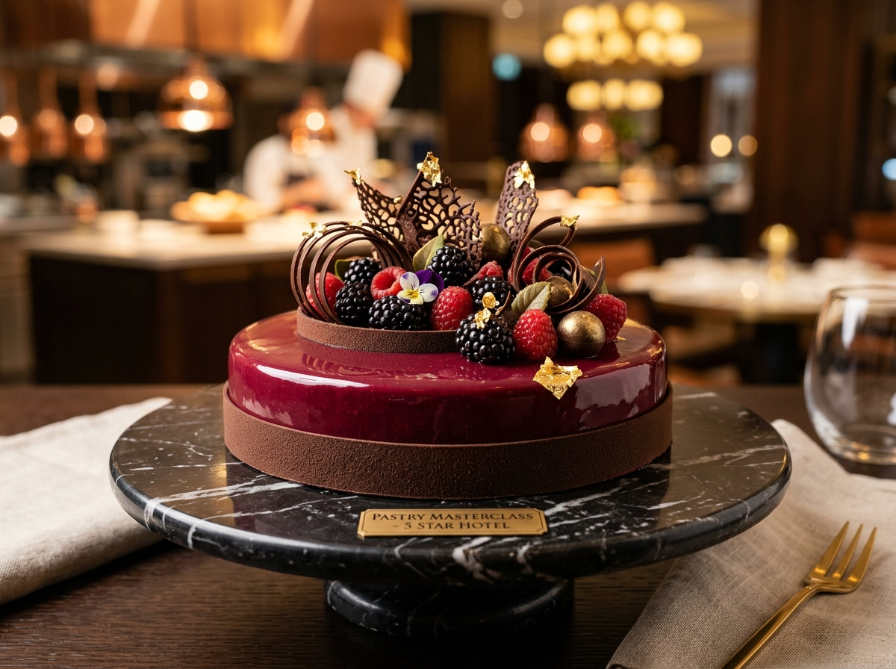

# BerryBrown Pâtisserie Atelier by Chef Safa 🍰✨
### *Haute Pâtisserie & Artisanal Cakes Handcrafted in Dubai*



BerryBrown is a luxury portfolio and e-commerce shopping website created for **Chef Safa**, an artisanal pastry chef based in Dubai, United Arab Emirates. With a professional **Diploma in Pastry & Culinary Arts** and rigorous experience in a prestigious **5-star hotel pastry brigade**, Chef Safa crafts haute French entremets, bespoke tiered celebration cakes, and seasonal fruit tarts.

---

## 🌟 Key Features

- **Artisanal E-Commerce Catalog**:
  - Filterable by *Haute Entremets*, *Celebration & Bespoke*, and *Artisan Tarts*.
  - Dynamic size variations (4" Petite, 6" Classic, 8" Grand, 10" Luxe) with real-time price updates in **AED**.
  - Interactive customizer for base flavors and complimentary hand-piped chocolate plaque inscriptions (with live visual preview).
  - Allergen notices, dietary tags (100% Halal, Gelatin-Free, Pure French AOP Butter, Valrhona Grand Cru), and fresh baking lead time notices.

- **Dubai-Centric Refrigerated Delivery & Checkout**:
  - Multi-step checkout dialog built with accessible native `<dialog>` controls.
  - Delivery mode selection: Temperature-controlled van delivery (3°C–5°C) across Dubai areas (*Downtown & DIFC, Palm Jumeirah & Marina, Business Bay, Jumeirah, Dubai Hills, Arabian Ranches, Mirdif, etc.*) or Free Studio Collection in Al Quoz.
  - Delivery calendar enforcing minimum baking notice and 2-hour delivery time slots.
  - Payment simulations: Credit / Debit Card (with 3D Secure badge), Apple Pay, Card / Cash on Delivery, and Direct WhatsApp Pay.
  - Itemized order confirmation invoice receipt with unique Order Reference (e.g. `#BB-2026-8941`).
  - One-click instant dispatch of formatted order details straight to Chef Safa's WhatsApp.

- **Interactive Bespoke Cake Consultation Builder**:
  - Step-by-step calculator for custom milestone celebrations and weddings.
  - Live budget estimator in AED based on occasion, tiers (1 to 4 tiers), guest counts, artisanal finishes (24k Gold Leaf, Velvet Chocolate Spray, Fresh Garden Florals), and flavor pairings.
  - Direct WhatsApp consultation link pre-populated with client specifications.

- **Chef Safa's Atelier Story & Credentials**:
  - Spotlight on Chef Safa’s pastry diploma and 5-star hotel background.
  - Atelier standards: raw noble ingredients, zero artificial stabilizers, low-sugar balanced profile.
  - Curated Dubai client testimonials and interactive FAQ accordion.

- **Modern Web Architecture & Visuals**:
  - Built with Vanilla CSS design system (curated Velvet Berry, Deep Ganache, Champagne Gold, and Whipped Cream Ivory palette).
  - Editorial typography: *Playfair Display* / *Cormorant Garamond* & *Plus Jakarta Sans*.
  - Fast, modular JavaScript bundled with **Vite**.
  - Bespoke photorealistic high-resolution pastry imagery generated specifically for the atelier.

---

## 🚀 Quick Start

### Prerequisites
- [Node.js](https://nodejs.org/) (v18 or higher recommended)
- [npm](https://www.npmjs.com/)

### Installation
```bash
# Clone repository
git clone https://github.com/SaadHazari/berrybrown-pastry.git
cd berrybrown-pastry

# Install dependencies
npm install

# Start local development server
npm run dev
```
Open [http://localhost:5173](http://localhost:5173) in your browser.

### Production Build
```bash
# Build optimized static assets for production
npm run build

# Preview production build locally
npm run preview
```

---

## 📁 Project Structure

```
BerryBrown Codebase/
├── index.html                      # Semantic HTML5 entry page with SEO metadata
├── package.json                    # Project scripts & dev dependencies
├── public/
│   ├── favicon.svg                 # Luxury gold & berry monogram favicon
│   └── images/                     # Bespoke pastry atelier assets
│       ├── hero_signature_cake.jpg
│       ├── pistachio_kunafa_cake.jpg
│       ├── valrhona_chocolate_entremet.jpg
│       ├── berry_charlotte_cake.jpg
│       ├── celebration_bespoke_cake.jpg
│       ├── exotic_mango_tart.jpg
│       └── chef_safa_portrait.jpg
├── src/
│   ├── main.js                     # Application entry point & coordination
│   ├── style.css                   # Master stylesheet importing modular styles
│   ├── components/
│   │   ├── cartManager.js          # Cart state, AED calculations, localStorage sync
│   │   ├── catalogRenderer.js      # Filterable cake grid & product detail modal
│   │   ├── cakeCustomizer.js       # Bespoke quote estimator & WhatsApp dispatcher
│   │   ├── checkoutModal.js        # Multi-step Dubai checkout & invoice receipt
│   │   ├── navigation.js           # Header, mobile menu, and slide-over cart drawer
│   │   └── toast.js                # Elegant notifications
│   ├── data/
│   │   ├── products.js             # Pâtisserie menu, sizes, flavors, allergens
│   │   ├── dubaiZones.js           # Dubai delivery zones, lead times, fees
│   │   └── testimonials.js         # Dubai clientele reviews & FAQ content
│   └── styles/
│       ├── variables.css           # Luxury color tokens, shadows, transitions
│       ├── base.css                # Typography & resets
│       ├── components.css          # Buttons, badges, nav, forms, toasts
│       ├── catalog.css             # Product cards & modal styling
│       ├── cart.css                # Slide-over cart drawer
│       ├── checkout.css            # Multi-step checkout wizard & receipt
│       ├── customizer.css          # Bespoke builder & Chef Safa story
│       └── responsive.css          # Mobile & tablet media queries
└── README.md
```

---

## 🇦🇪 Dubai Concierge & Atelier Details
- **Location**: Al Quoz Pastry Studio & Boutique, Dubai, UAE
- **Currency**: UAE Dirham (AED)
- **Direct WhatsApp**: [+971 50 123 4567](https://wa.me/971501234567)
- **Instagram**: `@berrybrown.pastry`
